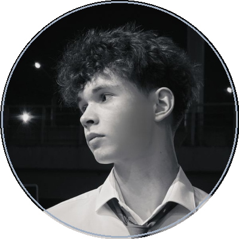

 

<h1 align="center" style="border-bottom: none; margin-top: 12px; margin-bottom: 4px;">Aleksandr Sorokoletov</h1>

  <b>Machine Learning Engineer</b> &bull; <b>Systems &amp; Backend Developer</b>

  BSUIR &middot; Software Engineering '29 &nbsp;|&nbsp; Minsk, Belarus

  
  &nbsp;
  
  &nbsp;
  
  &nbsp;
  

---

### Обо мне / Summary

Студент факультета компьютерного проектирования БГУИР (направление «Программная инженерия», 2025–2029).

Специализируюсь на **машинном обучении** (рекомендательные системы, NLP), **низкоуровневой обработке сигналов** и **высоконагруженной бэкенд-архитектуре**:
- **Applied ML & RecSys:** проектирование многостадийных рекомендательных систем — отбор кандидатов (Two-Tower архитектура), нейросетевое ранжирование (NeuMF), дообучение трансформеров (DistilBERT) и оптимизация инференса под ограничения железа.
- **Systems & Signal Processing:** разработка многопоточных аудио-пайплайнов реального времени на C++20 с низкой задержкой (low-latency DSP, CoreAudio, спектральный анализ).
- **Backend & Distributed Systems:** построение отказоустойчивых сервисов на Python / FastAPI / PostgreSQL, решение проблем конкурентности данных (race conditions, транзакции ACID, пессимистические блокировки) и асинхронные очереди задач.

---

### Стек технологий / Core Stack

  

  
  
  
  
  
  
  
  

---

### Избранные проекты / Featured Projects

<table>
  <!-- PROJECT 1: RecSys -->
  <tr>
    <td width="50%" valign="top">
      <h4><a href="https://github.com/Elate11/recsys">🛍️ RecSys: Two-Tower & Neural Ranking</a></h4>
      

        
      

      
Многостадийный рекомендательный пайплайн для e-commerce: от эвристических бейзлайнов до нейросетевых архитектур поиска кандидатов и ранжирования.

      <ul>
        <li>Реализация и сравнение <b>NeuMF</b> и двухбашенной <b>Two-Tower</b> модели с разделением пользователей и товаров на векторные представления (эмбеддинги).</li>
        <li>Оценка ранжирования по метрикам <code>NDCG@K</code>, <code>Precision@K</code>, <code>Recall@K</code> на валидационном корпусе.</li>
        <li>Упаковка инференса в асинхронный REST API на FastAPI в контейнере Docker.</li>
      </ul>
    </td>
    <!-- PROJECT 2: NLP Toolkit -->
    <td width="50%" valign="top">
      <h4><a href="https://github.com/Elate11/sentiment_analysis_project">📝 NLP Toolkit: Classification & Summarization</a></h4>
      

        
        
      

      
Сквозной пайплайн анализа тональности текста и бенчмарк методов автоматической суммаризации с оптимизацией под CPU.

      <ul>
        <li>Fine-tuning <code>distilbert-base-uncased</code> на корпусе отзывов с сохранением высокой обобщающей способности.</li>
        <li>Сравнительный бенчмарк экстрактивной и абстрактивной суммаризации (сохранение фактологии против связности).</li>
        <li>Оптимизация задержки (latency) инференса на CPU через квантование и эффективный батчинг.</li>
      </ul>
    </td>
  </tr>

  <!-- PROJECT 3: AuraSound Max -->
  <tr>
    <td width="50%" valign="top">
      <h4><a href="https://github.com/Elate11/AuraSound">🎵 AuraSound Max: Real-Time Audio DSP</a></h4>
      

        
      

      
Профессиональный аудиокомбайн и DSP-процессор для macOS с фазовой компенсацией задержки через микрофон и аппаратным микшером.

      <ul>
        <li>Многопоточный low-latency аудиопайплайн на C++20 с минимальным джиттером потока данных.</li>
        <li>Интеграция с виртуальными аудиодрайверами macOS и маршрутизация на уровне CoreAudio.</li>
        <li>Анализ фазы звуковой волны и акустическая компенсация пространственной задержки.</li>
      </ul>
    </td>
    <!-- PROJECT 4: IIS BSUIR Schedule App -->
    <td width="50%" valign="top">
      <h4><a href="https://github.com/Elate11/IIS_BSUIR_Shedule_app">📅 IIS BSUIR: Client & Schedule App</a></h4>
      

        
      

      
Современный мобильный клиент личного кабинета студента (ИИС БГУИР) с умным виджетом и оффлайн-доступом.

      <ul>
        <li>Авторизация и полная интеграция с закрытым API личного кабинета университета.</li>
        <li>Динамический календарь занятий с умными бейджами текущей пары и кэшированием.</li>
        <li>Чистая архитектура приложения с поддержкой современных гайдлайнов Material You.</li>
      </ul>
    </td>
  </tr>
</table>

---

### Аналитика активности / Activity

<table border="0">
  <tr>
    <td>
      
    </td>
    <td>
      
    </td>
  </tr>
</table>

 

---

  Aleksandr Sorokoletov &middot; BSUIR Software Engineering '29 &middot; Minsk

